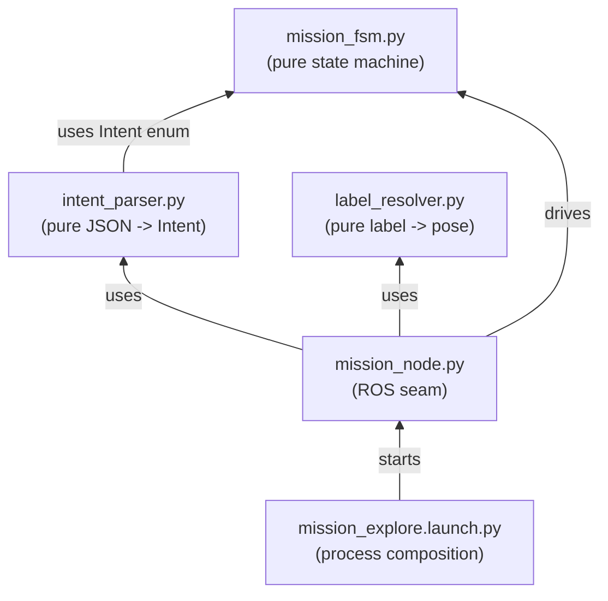

# dome_mission: Theory of Operation

## What this package is for

DOME is a mobile robot built from a stack of layered packages:
`dome_nav` provides navigation and mapping *primitives* — explore a room,
drive to a pose — with no idea what a "mission" is or why it's being
asked to do either. `dome_mission` is the layer directly above it: the
one place in the whole system that owns the question *"what should the
robot be doing right now, and why?"* It receives high-level requests
("start exploring," "go to the chair") over a single topic, `/intent`,
and turns each one into a sequence of calls against `dome_nav`'s two
primitives — the `ExploreArea` action and Nav2's `NavigateToPose` action —
while tracking which primitive (if any) is currently running and what
should happen when it finishes.

Everything else in the DOME system that wants the robot to *do* something
goes through `dome_mission`. Nothing downstream of it (in `dome_nav`)
understands intents at all anymore — that separation is itself a
significant piece of this package's design history, discussed below.

## The five files, and how they build on each other

Three modules (`mission_fsm.py`, `intent_parser.py`, `label_resolver.py`)
are pure Python: no ROS imports, no I/O, fully unit-testable with plain
asserts. They hold *all* of this package's actual decision-making logic.
One module (`mission_node.py`) is the ROS seam — a thin adapter that owns
every subscription, publisher, and action client, and translates between
live ROS messages and the pure modules' plain-Python vocabulary. One file
(`mission_explore.launch.py`) is process composition — it doesn't run any
of this package's own logic at all, it just starts `dome_nav`'s stack and
adds `mission_node` on top of it.

This is a *functional core, imperative shell* architecture, applied
deliberately and consistently: the "core" (the three pure modules) is
where correctness lives and where it's cheap to verify; the "shell"
(`mission_node.py` and the launch file) is where ROS's inherent
messiness — async callbacks, action lifecycles, process startup ordering —
is contained and kept from leaking into the parts of the system that are
supposed to be simple to reason about.

## The mission FSM: the actual center of gravity

`mission_fsm.py` (chapter 1) is where the real content of this package
lives. It's a four-state machine — `IDLE`, `EXPLORING`, `LOCATING`,
`GOING_TO_TARGET` — driven by two kinds of event: `Intent`s (requests
from outside: "start exploring," "go to X") and `Outcome`s (reports that
a previously-started primitive finished, and how). Its output is a list
of `Command`s — data, not function calls — for `mission_node.py` to carry
out. The single most important property of this state machine, stated as
an explicit invariant in its own chapter, is that **no event, well-formed
or not, can ever wedge it or crash it** — an inapplicable intent or a
mistimed outcome is always a silent no-op, never an exception. That
property is what lets a long-running node stay alive indefinitely against
an external world (voice commands, action servers) that can send events
in any order, at any time, including duplicated or out-of-order ones.

## The two boundary translators

`intent_parser.py` (chapter 2) and `label_resolver.py` (chapter 3) are
both *anti-corruption layers* in Eric Evans' sense: each keeps one
specific external representation from leaking into the rest of the
system. `intent_parser.py` turns arbitrary JSON off the wire into a
strictly-typed `ParsedIntent` or `None` — never anything in between, so
`mission_node.py` never has to think about malformed JSON, missing keys,
or wrong types more than once. `label_resolver.py` turns the robot's
current, pose-free notion of "the chair" into an actual `(x, y, yaw)`
goal, picking the nearest same-labelled candidate when the robot's own
position is known and falling back gracefully when it isn't. Both modules
share a philosophy with the FSM they feed: uniform, predictable failure
behavior (always `None`, never a raised exception, for the intent parser;
always resolvable or cleanly `None`, never an exception, for the label
resolver) so that every caller downstream can handle "this didn't work"
exactly once, in exactly one way.

## mission_node.py: the seam, not the substance

`mission_node.py` (chapter 4) is intentionally the least "interesting"
file in the package, in the sense that almost nothing in it makes a
*decision* — decisions were already made by the three modules above.
What it does is own the ROS graph: three subscriptions in
(`/intent`, `/semantic/targets`, `/amcl_pose`), two action clients out
(`ExploreArea`, `NavigateToPose`), and the bookkeeping each action's
asynchronous goal/result lifecycle demands (tracking a goal handle,
mapping a result code back to an `Outcome`, feeding that back into the
FSM). Reading this chapter alongside chapter 1 is the best way to see the
pure/impure split actually pay off: every one of `mission_node.py`'s
callback methods is short precisely because the hard part (what should
happen) was already decided elsewhere.

## The launch file: assembling a runnable system

`mission_explore.launch.py` (chapter 5) doesn't contain any of this
package's logic — it *composes* two of `dome_nav`'s pre-built launch
files (a simulated stack via Gazebo, or the real robot's stack) with this
package's `mission_node`, so that the single-`/intent`-handler invariant
the FSM and node are built around actually holds in the running system.
Its most interesting content isn't architectural, it's a documented
footgun: a naming collision between this file's own CLI flags and
`better_launch`'s reserved framework-global options, which silently
discarded a real value for months until traced and fixed by renaming
the colliding parameter. It's a good, concrete lesson in what "don't
reuse a framework's reserved names for something merely similar" costs
when ignored.

## What isn't wired up yet

Two real gaps exist in the live system today, both documented in
`05-issues/open/` and worth knowing before trusting a live demo of this
package fully:

- **I01**: `dome_nav`'s explorer has been observed to crash live on a
  particular exploration-completion path (frontier exhaustion), leaving
  `mission_node`'s FSM stuck waiting on a goal result that will never
  arrive — there is currently no watchdog/timeout to recover from this.
- **I02**: the explore/simulation stack this package's own launch file
  starts uses `slam_toolbox` for localization, not Nav2's `amcl` — so
  `mission_node`'s `/amcl_pose` subscription has no publisher in that
  configuration, meaning go-to-label has no live robot pose to resolve or
  drive from even once a semantic-target publisher exists.

Neither gap is a defect in this package's own pure logic — both FSM and
resolver already degrade gracefully in the presence of missing/late data.
Both are gaps in how the surrounding system (mostly `dome_nav`) is
composed and operated today.

## Reading order

1. `01-mission_fsm.md` — the state machine; start here, it's the center
   of the whole package.
2. `02-intent_parser.md` — how a request becomes an `Intent`.
3. `03-label_resolver.md` — how a label becomes a pose.
4. `04-mission_node.md` — how the above three get wired into a live ROS
   node.
5. `05-mission_explore_launch.md` — how a live system actually gets
   started.
6. `X01-nav_intent_check.md` — an appendix: a manual diagnostic tool for
   exercising the go-to-target path by hand.
