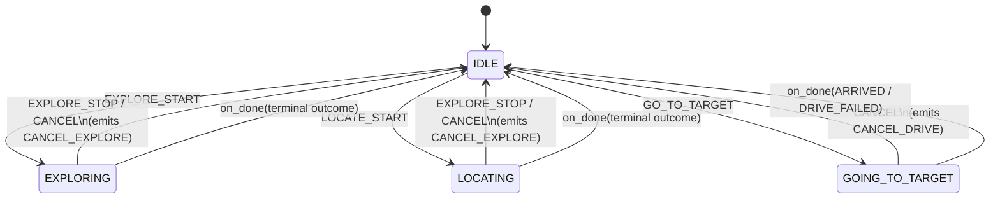

# The Mission FSM: a pure state machine for sequencing robot behaviors

## Why a state machine, and why pure?

`mission_fsm.py` decides which navigation primitive — `dome_nav`'s
`ExploreArea` action or Nav2's `NavigateToPose` — the robot should be
running at any moment, and what to do when one finishes. That's a natural
fit for a *finite state machine*: a small, closed set of situations
("idle," "exploring," "driving to a target") and a small, closed set of
things that can happen in each.

The interesting choice isn't the FSM itself — it's what the module
*refuses* to know. There's no `rclpy` import here, no action client, no
topic. The FSM is handed abstract `Intent` events (someone asked for
something) and `Outcome` values (a behavior finished, one way or another),
and it hands back `Command` values (what to do next) plus a mutated
`state`. How a command actually executes — which action server, how a
goal gets built — never leaks into this file.

This is a **functional core, imperative shell** architecture:

- The *core* (this file) is deterministic and side-effect-free. Same
  state, same event, same result, every time.
- The *shell* (`mission_node.py`) is where ROS's messy, async,
  stateful reality lives.

Keeping that boundary sharp is what makes this module trivially testable
with plain asserts, and a pain to break by accident.

## The vocabulary: four small enums

```python
class State(Enum):
    IDLE = auto()
    EXPLORING = auto()
    LOCATING = auto()
    GOING_TO_TARGET = auto()

class Intent(Enum):
    EXPLORE_START = auto()
    EXPLORE_STOP = auto()
    LOCATE_START = auto()
    GO_TO_TARGET = auto()
    CANCEL = auto()

class Outcome(Enum):
    EXPLORED_DONE = auto()
    STOPPED = auto()
    NO_TARGETS_BLOCKED = auto()
    ARRIVED = auto()
    DRIVE_FAILED = auto()

class CommandType(Enum):
    START_EXPLORE = auto()
    CANCEL_EXPLORE = auto()
    DRIVE_TO_TARGET = auto()
    CANCEL_DRIVE = auto()
```

Each enum plays a distinct role:

- **`State`** — where the mission currently is. Four values, deliberately few.
- **`Intent`** — an *input*: a request from outside (a voice command, a
  UI, a human via `ros2 topic pub`).
- **`Outcome`** — a different kind of input: not a request, but a *report*
  that a previously-started behavior finished. Its values deliberately
  mirror `ExploreArea`'s and `NavigateToPose`'s own result vocabularies,
  so the ROS-boundary mapping (in `mission_node.py`) is a lookup table,
  not logic.
- **`CommandType`** — an *output*: an instruction for the ROS seam to
  carry out. Every command the FSM can ever emit is one of exactly four
  kinds.

Splitting "requests" (`Intent`) from "reports" (`Outcome`) into two enums,
rather than one merged "event" type, means the FSM's two entry points
(below) can never be confused about *which kind* of thing triggered them —
a reviewer can tell from the method name alone.

A `Command` is a frozen dataclass — `type`, `map_name`, `label` — not a
function call. This is the *command pattern*: an instruction is reified as
data the FSM hands back, rather than something the FSM reaches out and
does itself. That's what keeps it pure.

## The transition graph



Every non-`IDLE` state has exactly one way in and one way out: a cancel
path and a natural-completion path, both landing back on `IDLE`. No state
can get stuck.

## Two entry points, matching the two kinds of event

```python
def on_intent(
    self, intent: Intent, *, label: str = "", map_name: str = ""
) -> list[Command]:
    if intent in (Intent.EXPLORE_START, Intent.LOCATE_START):
        return self.begin_explore(intent, map_name)
    if intent is Intent.GO_TO_TARGET:
        return self.begin_drive(label)
    if intent in (Intent.EXPLORE_STOP, Intent.CANCEL):
        return self.abort(intent)
    return []
```

`on_intent` is a three-way dispatch. The trailing `return []` isn't a
"shouldn't happen" branch — it's a *designed* no-op, the FSM's contract
for any event it doesn't recognize.

```python
def on_done(self, outcome: Outcome) -> list[Command]:
    """A running behavior reported a terminal outcome; return to IDLE. No
    follow-up command — the executor already saw the action result."""
    explore_done = self.state in EXPLORE_STATES and outcome in EXPLORE_OUTCOMES
    drive_done = self.state is State.GOING_TO_TARGET and outcome in DRIVE_OUTCOMES
    if explore_done or drive_done:
        self.state = State.IDLE
    return []
```

`on_done` *always* returns `[]`. Completion never triggers a follow-up
primitive on its own — the ROS seam already observed the action's result
just to call this method in the first place, so there's nothing left for
the FSM to instruct.

Notice the guard: `on_done(ARRIVED)` while the state is `EXPLORING` does
nothing at all. `drive_done` is `False` (wrong state), and `explore_done`
is `False` (`ARRIVED` isn't an explore outcome). An outcome that doesn't
belong to the currently-running behavior is silently ignored rather than
corrupting state.

## The one invariant that matters most

Combining both entry points' behavior gives the module its single most
important correctness property:

> **No event, well-formed or not, can ever raise an exception or leave
> the FSM in an inconsistent state.** An inapplicable event is always a
> no-op.

This matters because `/intent` events and action outcomes both arrive
*asynchronously*, from outside this process, in whatever order and at
whatever rate an external caller sends them:

- A duplicate `EXPLORE_START` while already exploring? No-op.
- A stray `on_done(ARRIVED)` while idle? No-op.
- A `GO_TO_TARGET` intent mid-explore? No-op (no preemption support yet).

A state machine that can throw on a mistimed or duplicate event is one
that will eventually take the whole node down with it. This one can't.

## The three private handlers

**`begin_explore`** and **`begin_drive`** both start with the same guard:

```python
if self.state is not State.IDLE:
    return []
```

This is a *guard clause used as concurrency control* — without a real
mutex, "one behavior at a time" is enforced purely by refusing to leave
`IDLE` unless the FSM is already there.

`EXPLORE_START` and `LOCATE_START` map to the *identical* command
(`START_EXPLORE`) but land in different states. Why keep two states for
one mechanism? The module docstring explains: *"F33 Phase C — ingest is
always-on and external, so LOCATING drives the same explore primitive,
differing only in mission intent/telemetry."* In other words, `LOCATING`
exists so a human or a log can tell *why* the robot is driving frontiers —
mapping the room, versus looking for something — even though the actual
motion is identical either way.

**`begin_drive`**'s inline comment is honest about a real limitation:

> *"IDLE-only for now; concurrent preempt (go while exploring) waits on
> T05 label->pose + a preempt policy."*

Asking to "go to the chair" mid-explore is simply ignored today — a
documented gap, not an accidental one.

**`abort`** has to disambiguate by *which* intent triggered it, not just
the current state:

```python
def abort(self, intent: Intent) -> list[Command]:
    if self.state in EXPLORE_STATES:
        self.state = State.IDLE
        return [Command(CommandType.CANCEL_EXPLORE)]
    if intent is Intent.CANCEL and self.state is State.GOING_TO_TARGET:
        self.state = State.IDLE
        return [Command(CommandType.CANCEL_DRIVE)]
    return []
```

- While exploring or locating: *either* `EXPLORE_STOP` or `CANCEL` stops it.
- While driving to a target: *only* `CANCEL` stops it — `EXPLORE_STOP`
  during `GOING_TO_TARGET` is correctly a no-op, since "stop exploring"
  doesn't mean anything for a drive-to-pose behavior.

This is the FSM enforcing *semantic*, not just structural, correctness —
an event has to mean what it claims, given where the mission currently is.

## Where mission-level authority ends

The class docstring records a boundary decision worth understanding, not
just reading:

> *"per-goal stop/abort authority (goal timeouts, `STUCK_T_S`, blacklist
> exhaustion, per-goal reselection) stays DOWN in `dome_nav`'s explorer
> watchdog and never surfaces as an FSM event. The FSM owns only
> mission-level authority."*

There are two very different granularities of "something went wrong":

1. **Tactical** — a single navigation goal getting stuck. `dome_nav`'s
   explorer already knows how to recover from this (blacklist the spot,
   pick a new frontier) *without* ending the session.
2. **Strategic** — the entire session ending, with no frontiers left or a
   hard stop.

Only the second is a *mission*-level event. If the FSM also reacted to
every per-goal hiccup, it would duplicate logic that already exists one
layer down, and blur the boundary between "what does the mission look
like right now" and "how is one goal currently being flown." Keeping that
boundary sharp is exactly what keeps this file this small.

## Observations

- **Fully unit-testable with plain asserts.** Every transition is a pure
  `(state, event) -> (state, commands)` function — no ROS graph, no
  mocking, no timing needed to exercise every branch.
- **No timeouts or retries anywhere.** A `GOING_TO_TARGET` session that
  never gets an `on_done` call sits in that state forever, from this
  module's point of view — liveness is guaranteed *elsewhere*, by design,
  not here.
- **The dead `return []` in `on_intent`** is unreachable today (all five
  `Intent` values are covered by the three branches above it), but it's
  the right kind of defensive code: a documented fallback, not a
  guess-and-repair. It quietly favors *robustness over fail-fast* for
  events arriving from outside the process — in tension with, but
  deliberately distinct from, how strictly `mission_node.py`'s own
  command dispatch treats an *internal* programming error.
- **`EXPLORE_STATES` / `EXPLORE_OUTCOMES` / `DRIVE_OUTCOMES`** exist
  purely so `on_done`'s guards read as prose ("state in EXPLORE_STATES
  and outcome in EXPLORE_OUTCOMES") instead of a wall of `or`-chained
  equality checks — a small readability win at negligible cost.
