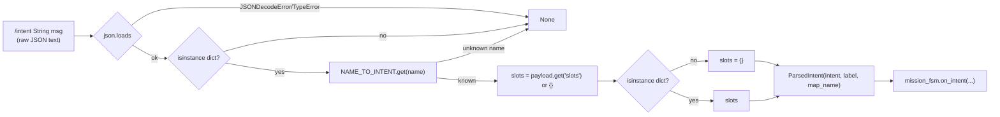

# The Intent Parser: translating a wire format into a typed event

## The problem this module solves

`dome_mission` owns a single ROS topic, `/intent`, through which the rest
of the DOME system — voice commands, a UI, another node, a human with
`ros2 topic pub` — asks the robot to do something. That topic carries a
`std_msgs/String`, and the string is JSON. JSON is a great wire format
(easy to construct from any language, easy to inspect by hand, forgiving
of small schema changes) and a terrible thing to program against directly:
every consumer would need to remember the exact key names, handle missing
keys, handle the wrong type turning up in a key, and so on, every time it
wants to know what a message means. `intent_parser.py` exists to do that
translation exactly once, in exactly one place, so that everything
downstream — starting with `mission_fsm.py` — never has to think about
JSON again.

This is the *anti-corruption layer* pattern (a term from Eric Evans'
domain-driven design vocabulary): a thin boundary module whose entire job
is to keep an external representation (here, arbitrary JSON from the wire)
from leaking its shape into the internal domain model (here, the `Intent`
enum from `mission_fsm.py`). Everything on the internal side of this
module gets to assume a clean, typed, already-validated `ParsedIntent` —
or `None`, and nothing else.

## The contract, stated as data

The whole mapping this module implements is small enough to fit in a
dictionary, and the code makes that literal:

```python
NAME_TO_INTENT = {
    "exploration_start": Intent.EXPLORE_START,
    "exploration_stop": Intent.EXPLORE_STOP,
    "navigation_go": Intent.GO_TO_TARGET,
    "navigation_cancel": Intent.CANCEL,
}
```

Four wire-level names, four `Intent` values. Note that `mission_fsm.py`
actually has a *fifth* `Intent` — `LOCATE_START` — which has no entry
here. That's not an oversight; it's a fact worth remembering when reading
this file: the wire protocol doesn't yet expose every mission-level
concept the FSM understands. `LOCATE_START` can only ever be reached
programmatically today (e.g. a future intent name, or a different trigger
entirely), never via a JSON payload on `/intent`. The parser's job isn't
to mirror the FSM's vocabulary one-for-one; it's to define *which subset*
of that vocabulary the outside world is currently allowed to invoke.

Choosing a `dict` lookup over a chain of `if/elif` string comparisons is a
small but real design choice: it makes the *entire* set of valid names
enumerable and inspectable (`NAME_TO_INTENT.keys()`), turns "is this name
valid" into an O(1) lookup, and — most importantly for a boundary module —
makes it structurally impossible to typo one branch's string differently
from how the FSM expects it, since there's only one place the string
literals live.

## The parse function, read top to bottom

```python
def parse_intent(json_str: str) -> ParsedIntent | None:
    """Map a raw `/intent` JSON payload to a `ParsedIntent`, or None if the
    JSON is malformed, not an object, or carries an unknown `name`."""
    try:
        payload = json.loads(json_str)
    except (json.JSONDecodeError, TypeError):
        return None
    if not isinstance(payload, dict):
        return None

    intent = NAME_TO_INTENT.get(payload.get("name", ""))
    if intent is None:
        return None

    slots = payload.get("slots") or {}
    if not isinstance(slots, dict):
        slots = {}
    label = slots.get("label", "") or ""
    map_name = slots.get("map_name", "") or ""
    return ParsedIntent(intent=intent, label=str(label), map_name=str(map_name))
```

This function is a sequence of four independent validation gates, each of
which can bail out with `None`, and the function reads almost like a
checklist a careful human would run through by hand:

1. **Is it even valid JSON?** `json.loads` can raise `JSONDecodeError` for
   malformed text, or (less obviously) `TypeError` if `json_str` isn't a
   string-like object at all — the `except` clause catches both, because a
   caller passing the wrong type entirely is just as much "not a usable
   intent" as a syntax error.
2. **Is the top-level JSON value an object (a dict), not a list, number,
   or bare string?** JSON is happy to parse `"42"` or `"[1,2,3]"` as valid
   JSON that is nonetheless useless here — this `isinstance` check rejects
   anything that parsed but isn't shaped like an intent message.
3. **Does `name` map to something we recognize?** `payload.get("name",
   "")` defaults to an empty string rather than `None` if `name` is
   missing entirely, which is a nice touch: it means a missing key and an
   unrecognized key are handled by the exact same downstream lookup
   (`NAME_TO_INTENT.get(..., default)` returns `None` either way) rather
   than needing separate branches.
4. **Are the `slots`, if present, actually a dict?** Same defensive
   pattern as step 2, applied one level deeper: `payload.get("slots") or
   {}` handles both "no `slots` key" and "`slots` is `null`" (JSON `null`
   deserializes to Python `None`, and `None or {}` is `{}`) in one
   expression, and the subsequent `isinstance` check catches the case
   where `slots` is present but is, say, a string or a list instead of an
   object.

## Why every failure path returns the same thing

Every one of those four gates returns exactly `None` on failure — never an
exception, never a partially-filled `ParsedIntent`, never a different
sentinel per failure kind. That uniformity is deliberate and it's what
makes the function's contract trivial to state and trivial to consume: *a
caller gets back either a fully-valid `ParsedIntent`, or `None` — there is
no third possibility.* `mission_node.py`'s `on_intent` handler reflects
this exactly:

```python
parsed = parse_intent(msg.data)
if parsed is None:
    self.get_logger().warning(f"Malformed or unknown intent: {msg.data!r}")
    return
```

One `if`, no `try/except`, no need to distinguish "bad JSON" from "unknown
intent name" from "slots weren't a dict" — because from the caller's
perspective those are all just "not a usable intent," and the parser has
already decided that classification isn't the caller's problem. This is
the same philosophy that shows up in `mission_fsm.py`'s "always return
`[]`, never raise, on an inapplicable event" — parsing untrusted external
input and driving a state machine from unpredictable external events are
both places where *graceful, uniform rejection* beats a taxonomy of
exceptions the caller would just have to catch and collapse back down to
one behavior anyway.

## Coercion at the edges, trust in the middle

Look closely at the final line:

```python
return ParsedIntent(intent=intent, label=str(label), map_name=str(map_name))
```

`label` and `map_name` get wrapped in `str(...)` even though they were
already extracted with `.get("label", "") or ""` — which, if the JSON
value at that key were, say, a number (`{"slots": {"label": 42}}`), would
leave `label` holding the int `42`, not a string, at the point the `str()`
call runs. This is the parser choosing *coercion* over *rejection* for
this one specific case — a technically-malformed slot value (wrong type
for `label`) doesn't abort the whole parse the way a malformed top-level
shape does; it just gets stringified and passed through. That's a
judgment call worth noticing precisely because it's the *only* place in
this module where "wrong shape" doesn't mean "reject" — everywhere else
(steps 1-4 above) a shape mismatch is fatal to the parse. The asymmetry
makes sense once you consider what `label` and `map_name` are used for
downstream: opaque strings compared for equality (a label name, a map
name) rather than data that gets computed on, so silently accepting
"whatever was there, stringified" is low-risk and more forgiving of a
slightly-off caller than a hard rejection would be — while `name` (which
*controls* what happens next, not just what payload comes along for the
ride) gets no such leniency.

## Data flow, end to end



Everything to the left of `ParsedIntent` is untrusted; everything to the
right — starting with `mission_fsm.py` — can assume a well-typed,
already-validated event and never has to think about JSON, missing keys,
or wrong types again.

## Observations

- **`ParsedIntent` is a frozen dataclass with defaults**: `label: str =
  ""` and `map_name: str = ""` mean every `ParsedIntent` always has both
  fields populated (possibly with empty strings) rather than needing
  `Optional` fields the consumer has to `None`-check. Combined with the
  parser's own `.get(..., "") or ""` pattern, "absent" and "empty string"
  are treated as the same thing end to end — a simplification that works
  well here because neither field is ever meaningfully different from ""
  when unset (there's no valid label or map name that *is* the empty
  string).
- **No schema versioning on `/intent` itself**: unlike
  `SemanticTargetArray` (see `label_resolver.py` / `mission_node.py`),
  which carries an explicit `schema_version` field the node gates on,
  `/intent`'s JSON payload has no version marker. If the wire contract
  ever needs to change in a backward-incompatible way, `parse_intent`
  would need a new mechanism to distinguish old- and new-shaped payloads —
  worth keeping in mind if `/intent` ever needs to evolve.
- **`NAME_TO_INTENT` doesn't cover `LOCATE_START`**: as noted above, this
  is either an intentional near-term limitation (the wire protocol hasn't
  caught up to the FSM's full vocabulary yet) or a small gap depending on
  whether a "locate" voice/UI command is expected soon — worth a quick
  check against the F33 plan before assuming it's deliberate.
