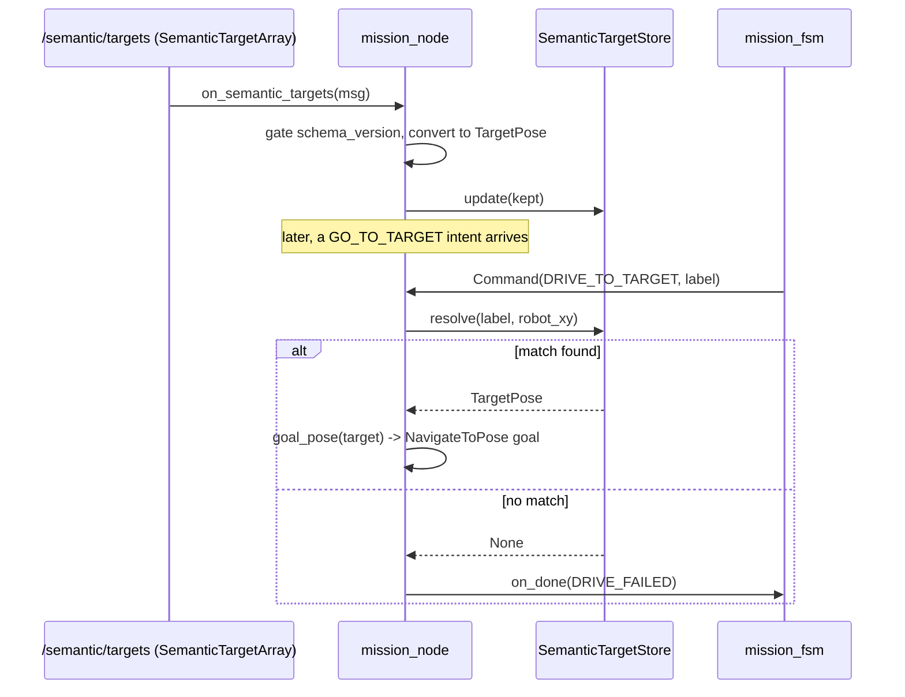

# The Label Resolver: turning "go to the chair" into a pose

## The problem: names aren't poses

Nav2's `NavigateToPose` action wants a `PoseStamped` — an exact `(x, y,
yaw)` in some frame. But nobody asks a robot to "go to (2.04, 0.15, 37
degrees)"; they ask it to go to *the chair*. Somewhere in the system there
has to be a translation from a human-meaningful label to a geometric goal,
and — because the same label can plausibly be seen more than once, in more
than one place (two chairs, both confidently labeled "chair") — that
translation has to make a choice when there's ambiguity. `label_resolver.py`
is that translation layer: a small, pure module holding the robot's current
belief about where labeled things are, and a `resolve()` method that picks
one when asked.

Like `mission_fsm.py`, this module is deliberately framework-free. It
doesn't subscribe to anything, doesn't know about `SemanticTargetArray`
messages or quaternions-as-ROS-types — it works with a plain `TargetPose`
dataclass and plain tuples. The ROS boundary (`mission_node.py`) is
responsible for converting the typed message into `TargetPose` values
*before* handing them to this module. That conversion work — reading
`schema_version`, pulling `x`/`y` out of a `geometry_msgs/Pose`, converting
a quaternion to yaw — happens once, at the edge, and everything on this
side of the boundary works with plain, ROS-free values.

## The two building blocks

```python
@dataclass(frozen=True)
class TargetPose:
    """One confirmed target, map frame. x_m/y_m in meters, yaw_rad in radians."""

    label: str
    target_id: str
    x_m: float
    y_m: float
    yaw_rad: float
```

`TargetPose` is the module's entire vocabulary for "a place in the world
with a name." Note what it *doesn't* have: no covariance, no confidence
score, no timestamp. Those concerns — is this observation trustworthy, is
it stale — are handled upstream (in whatever populates the store) or not
at all yet; this dataclass only carries what `resolve()` actually needs to
do its job: a label to match against, an id to distinguish multiple
targets sharing a label, and a 2D pose to rank by distance and to steer
toward. The field names bake in their units (`x_m`, `y_m`, `yaw_rad`) —
following the project's naming convention of making unit confusion a
compile-time-adjacent, grep-able non-issue rather than a runtime bug
waiting to happen.

```python
def yaw_from_quaternion(z: float, w: float) -> float:
    """Planar (z-axis only) quaternion -> yaw. Matches the z=sin(yaw/2),
    w=cos(yaw/2) encoding used when building the drive goal."""
    return 2.0 * math.atan2(z, w)
```

This is a deliberately narrow special case of quaternion-to-Euler
conversion, not a general one. A full quaternion has four components
(`x, y, z, w`) and, in general, converting one to yaw/pitch/roll requires
all four and a choice of rotation order. But DOME is a ground robot that
only ever rotates about the vertical (z) axis — it can't pitch or roll —
so every orientation it ever has or is ever asked to reach is a *planar*
rotation, fully described by `z` and `w` alone (`x` and `y` are always
zero for a pure z-axis rotation). The formula `yaw = 2 * atan2(z, w)` is
the closed-form inverse of the encoding used everywhere else in this
codebase to build a planar orientation:
`z = sin(yaw/2), w = cos(yaw/2)` (visible, for instance, in
`mission_node.py`'s `goal_pose()`, and again in `tools/nav_intent_check.py`'s
`send_target()`). Because `atan2` (rather than a plain division-based
`asin`/`acos`) is used, the conversion is well-behaved and unambiguous
across the full ±180° range without any special-casing near the poles of
a bare arcsine.

This is a good example of *knowing your domain* paying off in code
simplicity: a general-purpose robotics library would need the full,
more expensive quaternion→Euler machinery (and would have to worry about
gimbal lock across three axes); because this codebase knows its robot
can only rotate in the plane, it gets to use a two-line formula instead
and there is no gimbal lock to worry about at all — the ambiguity that
plagues 3D Euler conversions simply doesn't exist for a single-axis
rotation.

## The store: latest snapshot, not a history

```python
@dataclass
class SemanticTargetStore:
    """Latest confirmed targets + nearest-match label resolution."""

    targets: list[TargetPose] = field(default_factory=list)

    def update(self, targets: list[TargetPose]):
        self.targets = list(targets)
```

`SemanticTargetStore` deliberately isn't an incremental, merge-as-you-go
structure — `update()` doesn't add targets to what's already there, it
*replaces* the whole list. This mirrors how the upstream semantic-mapping
system is expected to work (per `mission_node.py`'s `on_semantic_targets`,
which is triggered by the whole `SemanticTargetArray` topic, not a
per-target stream): every message on `/semantic/targets` carries the
*complete current belief* about confirmed targets, not a delta. That
makes `SemanticTargetStore` a "latest snapshot" cache, not a database —
simpler to reason about (no need to expire, dedupe, or merge stale
entries against fresh ones) at the cost of depending entirely on the
publisher sending complete snapshots reliably. `list(targets)` (rather
than assigning the incoming list directly) is a small but meaningful
defensive copy: it protects the store from a caller that later mutates
the list object it originally handed over.

## Resolving a label: nearest match wins, with a graceful fallback

```python
def resolve(
    self, label: str, robot_xy: tuple[float, float] | None
) -> TargetPose | None:
    """Nearest label-matching target to robot_xy, or None if no match.
    robot_xy None -> first match (no pose to rank by)."""
    matches = [target for target in self.targets if target.label == label]
    if not matches:
        return None
    if robot_xy is None:
        return matches[0]
    robot_x, robot_y = robot_xy

    def distance(target: TargetPose) -> float:
        return math.hypot(target.x_m - robot_x, target.y_m - robot_y)

    return min(matches, key=distance)
```

Three cases, read top to bottom:

1. **No target with this label at all** → `None`. The caller
   (`mission_node.drive_to_label`) turns this directly into
   `Outcome.DRIVE_FAILED`, which the FSM maps back to `IDLE` — a clean,
   well-defined failure rather than an exception bubbling up through a
   ROS callback.
2. **One or more matches, but no known robot position** → the *first*
   match, arbitrarily. This is a considered fallback, not a bug: the
   docstring is explicit ("no pose to rank by"), and the alternative —
   refusing to resolve at all just because localization data hasn't
   arrived yet — would make the whole go-to-target behavior strictly
   *less* available whenever pose tracking is briefly unavailable, for no
   real accuracy benefit (with no pose, there is no principled way to
   pick a "better" match anyway).
3. **One or more matches, robot position known** → the nearest one, by
   plain Euclidean distance (`math.hypot`, the numerically well-behaved
   way to compute `sqrt(dx² + dy²)` — it avoids the intermediate overflow
   or precision loss a naive `sqrt(dx**2 + dy**2)` can suffer for very
   large or very small components).

The `min(matches, key=distance)` line is a clean, idiomatic instance of a
*linear scan for the arg-min* — the standard, simplest algorithm for
"which of these N things is closest," with O(n) time and O(1) extra space
where n is the number of same-labelled targets (typically tiny — a handful
of chairs, not thousands). There's no spatial index here (no k-d tree, no
grid), and there doesn't need to be one: this only ever scans candidates
that already share a label, which in practice is a small set, not the
robot's entire semantic map.

## Where this fits in the go-to-target flow



The store sits quietly updating in the background every time a new
`SemanticTargetArray` arrives, and only gets *queried* — via `resolve()` —
at the moment a `DRIVE_TO_TARGET` command needs an actual pose to drive
to. It is, in effect, a small, purpose-built read-mostly cache sitting
between an asynchronous producer (whatever publishes `/semantic/targets`,
today nothing — see the F33 blocker in the project's `current.md`) and an
on-demand consumer (`drive_to_label`).

## Observations

- **Named the "typed successor to `nav_manager`'s
  `find_nearest_confirmed`"** (per the module docstring): this is a
  rewrite of pre-existing logic from a predecessor node, now carrying yaw
  where the old version apparently didn't. Worth knowing if debugging
  against old expectations — the resolution *policy* (nearest wins, first
  as fallback) is preserved, but the shape of the data it operates on is
  new.
- **No tie-breaking rule beyond `min`'s stability**: if two targets with
  the same label are exactly equidistant from the robot, `min()` returns
  the first one encountered in `matches` (Python's `min` is stable in
  that sense) — deterministic, but not something the docstring calls out
  explicitly. Unlikely to matter in practice (exact ties are a measure-zero
  event with real sensor data) but worth knowing if a test ever seems to
  pick a surprising target.
- **No staleness / expiry**: a target confirmed once, long ago, and never
  seen since remains resolvable forever, with equal weight to one seen a
  moment ago — the "latest snapshot" model (see `SemanticTargetStore`
  above) is only as fresh as the *last* `SemanticTargetArray` message,
  which itself is expected to already reflect current confidence (that
  filtering, if any, is presumably upstream, in whatever publishes to
  `/semantic/targets`).
