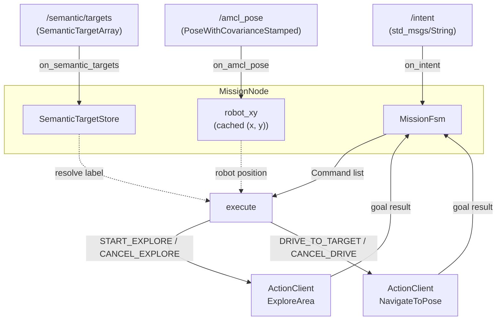
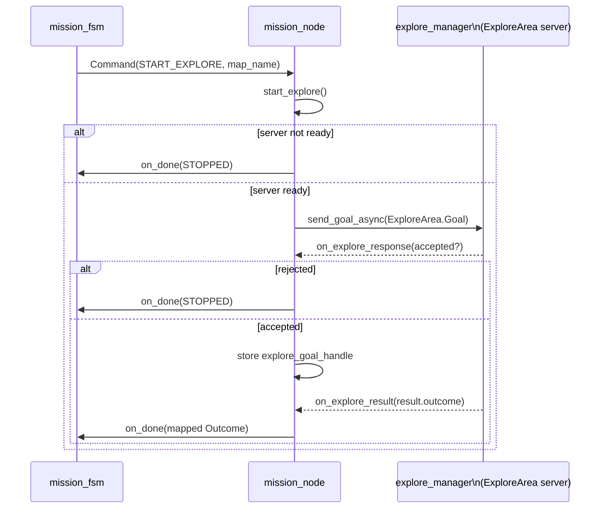

# The Mission Node: where pure logic meets the ROS graph

## The role of this file

Every other module documented so far — `mission_fsm.py`, `intent_parser.py`,
`label_resolver.py` — is deliberately ROS-free: no `rclpy`, no topics, no
actions, testable with plain asserts. `mission_node.py` is the opposite by
design: it is *entirely* the ROS seam. Its job is to own every actual
subscription, publisher, and action client the mission layer needs, and to
translate between the messy, asynchronous, callback-driven world of a live
ROS graph and the clean synchronous function calls the pure modules expect.

The class docstring states this plainly: *"The FSM/parser/resolver hold the
logic; this node is the ROS seam."* Reading this file well means reading it
as plumbing, not policy — every interesting *decision* (should we start
exploring, is this outcome terminal, which target is nearest) has already
been made by one of the three modules covered so far. What's left here is:
receive a message, convert it into the pure module's vocabulary, call the
pure module, and turn whatever it hands back into ROS actions. Doing that
translation cleanly, with the async bookkeeping ROS actions demand, is
this file's entire reason to exist.

## Everything the node owns, at a glance

```python
def __init__(self):
    super().__init__("mission_node")
    self.fsm = MissionFsm()
    self.store = SemanticTargetStore()
    self.robot_xy = None
    self.drive_goal_handle = None
    self.explore_goal_handle = None
    self.nav_client = ActionClient(self, NavigateToPose, "navigate_to_pose")
    self.explore_client = ActionClient(self, ExploreArea, "explore_area")
    self.intent_sub = self.create_subscription(String, "/intent", self.on_intent, 10)
    self.targets_sub = self.create_subscription(
        SemanticTargetArray, SEMANTIC_TARGETS_TOPIC, self.on_semantic_targets, 10
    )
    self.amcl_sub = self.create_subscription(
        PoseWithCovarianceStamped, "/amcl_pose", self.on_amcl_pose, 10
    )
    state_qos = QoSProfile(depth=1, durability=QoSDurabilityPolicy.TRANSIENT_LOCAL)
    self.state_pub = self.create_publisher(String, "/mission/state", state_qos)
    self.publish_mission_state()
    self.get_logger().info("dome_mission mission_node up; owns /intent")
```

Everything the node needs across its whole lifetime is set up once here,
in one place: two `ActionClient`s (one per primitive it composes), three
subscriptions (one command channel in, two state-tracking channels in),
and one outbound publisher. There's no dynamic subscription or client
creation anywhere else in the file — this constructor *is* the complete
wiring diagram for the node's ROS surface.

`/mission/state` (F22, `dome_control`'s companion feature) is the one
piece of `MissionNode`'s state that's externally observable at all — the
FSM's state otherwise only ever reaches a log line. It's published once
here at startup (so a subscriber that connects before any intent arrives
still sees `IDLE` immediately) and `TRANSIENT_LOCAL` QoS means a
subscriber that connects *after* startup also gets the last value without
waiting on the next transition — the standard ROS2 "latched topic"
pattern.



Two independent "inbound" flows (intent → FSM → commands, and
targets/pose → store/cache) and two independent "outbound" action
lifecycles, tied together by the single `execute()` dispatch method. The
rest of this document walks each of these four pieces in turn.

## Ingesting intents: the shortest path in the file

```python
def on_intent(self, msg: String):
    parsed = parse_intent(msg.data)
    if parsed is None:
        self.get_logger().warning(f"Malformed or unknown intent: {msg.data!r}")
        return
    commands = self.fsm.on_intent(
        parsed.intent, label=parsed.label, map_name=parsed.map_name
    )
    self.get_logger().info(
        f"intent {parsed.intent.name} -> state {self.fsm.state.name}"
    )
    self.publish_mission_state()
    for command in commands:
        self.execute(command)
```

This is the file's clearest illustration of the "thin seam" principle:
four lines of actual logic. Parse (delegating entirely to
`intent_parser.parse_intent`), reject-and-log if unparseable, hand the
parsed intent to the FSM, execute whatever commands come back — and,
alongside the existing state log line, re-publish `/mission/state` so an
external reader sees this transition too.

One scope boundary worth naming: only the transition `on_intent` itself
makes is published. `execute(command)` can trigger further FSM
transitions asynchronously (e.g. `start_explore` calling
`fsm.on_done(STOPPED)` immediately if the `ExploreArea` server isn't
ready) — those are *not* separately published. A reader polling
`/mission/state` right after a command sees the state `on_intent` landed
on, which may already be stale by the time an async callback resolves;
it's a snapshot, not a guaranteed-current value.

Note that today the FSM only ever returns zero or one command per `on_intent` call
(see `mission_fsm.py` — every handler returns a list of at most one
`Command`), but this code doesn't assume that: it loops over `commands`
unconditionally, which means if the FSM's contract ever grows to emit
multiple commands per intent (say, a future preemption path that both
cancels an old behavior and starts a new one), this call site needs no
change at all. That's what it means for a boundary to be *designed*
around its neighbor's contract rather than around today's observed
behavior.

## Ingesting the semantic map: gate, convert, replace

```python
def on_semantic_targets(self, msg: SemanticTargetArray):
    """Ingest the typed semantic map: gate schema_version, convert each Pose
    to a pure TargetPose (yaw from the planar quaternion), refresh the store."""
    kept = []
    dropped = 0
    for target in msg.targets:
        if target.schema_version != EXPECTED_SCHEMA_VERSION:
            dropped += 1
            continue
        yaw_rad = yaw_from_quaternion(
            target.pose.orientation.z, target.pose.orientation.w
        )
        kept.append(
            TargetPose(
                label=target.label,
                target_id=target.target_id,
                x_m=target.pose.position.x,
                y_m=target.pose.position.y,
                yaw_rad=yaw_rad,
            )
        )
    if dropped:
        self.get_logger().warning(
            f"Dropped {dropped} target(s) with schema_version != "
            f"{EXPECTED_SCHEMA_VERSION}"
        )
    self.store.update(kept)
```

This is exactly the "anti-corruption layer" work the docstring promises:
raw `SemanticTarget` ROS messages come in, pure `TargetPose` values go out
to the store, and *only* well-formed, current-schema targets make the
crossing. `EXPECTED_SCHEMA_VERSION = 1` (a module-level constant) is the
node's declared contract with whatever publishes `/semantic/targets`:
rather than trying to interpret or migrate an unexpected schema version
in-place, the node simply refuses targets it doesn't recognize and *says
so out loud* (the `WARNING` log) rather than silently dropping them. This
is the project's "report, don't guess and fix" error-handling philosophy
in miniature: a schema mismatch is treated as a real, surfaced condition
worth a human noticing, not something to be quietly coerced into
compatibility.

The per-target loop is a straightforward filter-map: skip anything
mismatched, otherwise convert (position straight across, orientation
through `yaw_from_quaternion` from `label_resolver.py`) and accumulate.
Whatever survives — the *entire* survivor list, not an incremental
addition — replaces the store's previous contents via `store.update(kept)`,
matching `SemanticTargetStore`'s own "latest snapshot, not history" model
documented in the label-resolver chapter.

## Tracking the robot's own position

```python
def on_amcl_pose(self, msg: PoseWithCovarianceStamped):
    position = msg.pose.pose.position
    self.robot_xy = (position.x, position.y)
```

The simplest handler in the file: unwrap a doubly-nested `pose.pose.position`
(the outer `pose` is the `PoseWithCovariance`, the inner `.pose` is the
plain `Pose` inside it — `PoseWithCovarianceStamped` nests three levels
deep before reaching bare `x`/`y`), and cache the 2D position for
`label_resolver.resolve()` to rank distances against later.

This is a good place to flag something the code itself can't tell you:
**as deployed via `launch/mission_explore.launch.py`'s explore/sim path,
nothing in the running stack ever publishes `/amcl_pose`.** That topic is
produced by Nav2's `amcl` node, which is part of `dome_nav`'s
*localization-mode* stack (a saved map + particle-filter localization) —
but the explore stack this node is actually launched alongside uses
`slam_toolbox` instead (build the map and localize simultaneously; no
`amcl` in the picture at all). Confirmed live: no remap anywhere makes
`slam_toolbox` publish onto `/amcl_pose`. The practical consequence is
that `on_amcl_pose` simply never fires during an explore run, so
`self.robot_xy` stays `None` for the entire session — which
`label_resolver.resolve()` already handles gracefully (falls back to
"first match" rather than failing), but it does mean nearest-match
ranking is currently unreachable in the explore/sim configuration this
package actually ships a launch file for. This is tracked as
`05-issues/open/I02-no-amcl-in-explore-stack-blocks-go-to-label.md` — worth
reading before assuming pose-based ranking is exercised by any live test
run today.

## The dispatch table: one command type, one handler

```python
def execute(self, command: Command):
    handlers = {
        CommandType.DRIVE_TO_TARGET: lambda: self.drive_to_label(command.label),
        CommandType.CANCEL_DRIVE: self.cancel_drive,
        CommandType.START_EXPLORE: lambda: self.start_explore(command.map_name),
        CommandType.CANCEL_EXPLORE: self.cancel_explore,
    }
    handlers[command.type]()
```

A dictionary literal used as a dispatch table is a common and readable
alternative to a four-branch `if/elif` chain, especially here where the
mapping is exactly one command type to exactly one handler with no shared
logic between branches. Two of the four handlers need the command's
payload (`command.label`, `command.map_name`) and are wrapped in a small
`lambda` to capture it; the other two (`cancel_drive`, `cancel_explore`)
take no arguments and are referenced directly. Because `CommandType` is a
closed `Enum` and every one of its four values has an entry here, this
dict is a complete mapping — there is no `else`/default branch, and
`handlers[command.type]()` would raise `KeyError` if that were ever not
true. That's a deliberate, if implicit, assertion: *if `mission_fsm.py`
ever emits a `CommandType` this dispatch table doesn't know about, that's
a programming error worth crashing loudly for*, in contrast to the FSM's
own philosophy of silently ignoring unrecognized *events*. The two
modules are, correctly, held to different standards — an unrecognized
inbound event from the outside world is expected and handled gracefully;
an unrecognized outbound command from a module in the same codebase is a
bug and should be visible immediately.

## The ExploreArea action lifecycle

Starting, tracking, and finishing an explore session spans four methods
that together form one asynchronous round trip:

```python
def start_explore(self, map_name: str):
    if not self.explore_client.server_is_ready():
        self.get_logger().error("ExploreArea server unavailable")
        self.fsm.on_done(Outcome.STOPPED)
        return
    goal = ExploreArea.Goal()
    goal.map_name = map_name
    send_future = self.explore_client.send_goal_async(goal)
    send_future.add_done_callback(self.on_explore_response)
    self.get_logger().info(f"Exploring (map_name={map_name!r})")


def on_explore_response(self, future):
    handle = future.result()
    if not handle.accepted:
        self.get_logger().warning("Explore goal rejected")
        self.fsm.on_done(Outcome.STOPPED)
        return
    self.explore_goal_handle = handle
    handle.get_result_async().add_done_callback(self.on_explore_result)


def on_explore_result(self, future):
    self.explore_goal_handle = None
    outcome = EXPLORE_OUTCOMES.get(future.result().result.outcome, Outcome.STOPPED)
    self.fsm.on_done(outcome)


def cancel_explore(self):
    if self.explore_goal_handle is not None:
        self.explore_goal_handle.cancel_goal_async()
        self.explore_goal_handle = None
```



Every branch of this lifecycle — server unreachable, goal rejected, goal
completed — ends the same way: a call to `self.fsm.on_done(...)`. This is
what makes the FSM's earlier-documented invariant ("no event can wedge
it") actually pay off operationally: no matter *how* an explore session
fails to even get started, the FSM still gets told it's over and returns
itself to `IDLE`, rather than staying in `EXPLORING` forever waiting for a
result that will never arrive. The one exception worth naming explicitly:
`server_is_ready()` and `accepted` failures are handled synchronously and
correctly, but if the goal *is* accepted and the server then crashes
mid-session without ever completing the goal — which has been observed
live (see `05-issues/open/I01-explore-manager-crash-on-completion.md`) —
`on_explore_result`'s callback simply never fires, because the action
result future never resolves. In that scenario the node itself survives,
but the FSM is left in `EXPLORING` indefinitely with no timeout to rescue
it — a real, currently-unhandled gap surfaced by that crash, not a
theoretical one.

`EXPLORE_OUTCOMES` — the module-level lookup table just above the class —
is the seam between `dome_nav_msgs`' `ExploreArea.Result` outcome codes
and this package's own `Outcome` enum:

```python
EXPLORE_OUTCOMES = {
    ExploreArea.Result.EXPLORED_DONE: Outcome.EXPLORED_DONE,
    ExploreArea.Result.STOPPED: Outcome.STOPPED,
    ExploreArea.Result.NO_TARGETS_BLOCKED: Outcome.NO_TARGETS_BLOCKED,
}
```

Note `.get(..., Outcome.STOPPED)` at the call site — an outcome code this
node doesn't recognize maps to `STOPPED` by default, rather than raising.
That's a deliberately forgiving choice given the value is coming from a
different package's action definition (`dome_nav_msgs`) that this node
doesn't control the evolution of: a *new* outcome code added to
`ExploreArea` upstream degrades to "treat it as stopped" here instead of
crashing the node — arguably in tension with the FSM's crash-on-unmapped-
command-type stance described above, but a reasonable one given `Outcome`
codes cross a package boundary while `CommandType` never leaves this
codebase.

## The NavigateToPose lifecycle: resolve, build, drive

```python
def drive_to_label(self, label: str):
    target = self.store.resolve(label, self.robot_xy)
    if target is None:
        self.get_logger().warning(f"No confirmed target for label {label!r}")
        self.fsm.on_done(Outcome.DRIVE_FAILED)
        return
    if not self.nav_client.wait_for_server(timeout_sec=1.0):
        self.get_logger().error("NavigateToPose server unavailable")
        self.fsm.on_done(Outcome.DRIVE_FAILED)
        return
    goal = NavigateToPose.Goal()
    goal.pose = self.goal_pose(target)
    send_future = self.nav_client.send_goal_async(goal)
    send_future.add_done_callback(self.on_goal_response)
    self.get_logger().info(f"Driving to {label!r} at ({target.x_m}, {target.y_m})")
```

This mirrors `start_explore`'s shape closely (check readiness, build a
goal, send async, attach a callback) with one structural difference worth
noting: `start_explore` checks `server_is_ready()` (non-blocking, an
instantaneous poll), while `drive_to_label` calls
`wait_for_server(timeout_sec=1.0)` (blocking up to a second). Nav2's
`NavigateToPose` action server can genuinely take a moment to come up
after the rest of the stack is alive (it depends on costmaps, TF, and
several lifecycle-managed nodes all reaching `ACTIVE`), so giving it a
short grace period here — rather than failing immediately the instant it
isn't already ready — avoids spurious `DRIVE_FAILED` results during
normal startup timing. `explore_area`'s server, by contrast, is a single,
simpler node (`explorer_manager_node`) that's either up or it isn't by
the time a goal is likely to be sent.

```python
def goal_pose(self, target: TargetPose) -> PoseStamped:
    pose = PoseStamped()
    pose.header.frame_id = "map"
    pose.header.stamp = self.get_clock().now().to_msg()
    pose.pose.position.x = target.x_m
    pose.pose.position.y = target.y_m
    pose.pose.orientation.z = math.sin(target.yaw_rad / 2.0)
    pose.pose.orientation.w = math.cos(target.yaw_rad / 2.0)
    return pose
```

The inverse of `label_resolver.yaw_from_quaternion` — where that function
decodes `z, w` back into a yaw angle, this one encodes a yaw angle back
into `z, w` (with `x` and `y` left at their zero default, consistent with
the planar-rotation-only assumption documented in the label-resolver
chapter). `frame_id = "map"` matters: `TargetPose` coordinates come from
the semantic map, which is itself expressed in the map frame, so the
`NavigateToPose` goal must declare the same frame or Nav2 would transform
the pose incorrectly (or reject it).

```python
def on_goal_response(self, future):
    handle = future.result()
    if not handle.accepted:
        self.get_logger().warning("Drive goal rejected")
        self.fsm.on_done(Outcome.DRIVE_FAILED)
        return
    self.drive_goal_handle = handle
    handle.get_result_async().add_done_callback(self.on_drive_result)


def on_drive_result(self, future):
    self.drive_goal_handle = None
    status = future.result().status
    if status == GoalStatus.STATUS_SUCCEEDED:
        self.fsm.on_done(Outcome.ARRIVED)
    else:
        self.fsm.on_done(Outcome.DRIVE_FAILED)


def cancel_drive(self):
    if self.drive_goal_handle is not None:
        self.drive_goal_handle.cancel_goal_async()
        self.drive_goal_handle = None
```

Structurally identical to the explore lifecycle's response/result/cancel
trio, with one interesting difference in how "did it work" gets decided:
`on_explore_result` reads a *domain-specific* result field
(`result.result.outcome`, an enum defined by `dome_nav_msgs`), while
`on_drive_result` reads the *generic* action-status field
(`GoalStatus.STATUS_SUCCEEDED`, defined by `action_msgs`, common to every
ROS2 action). That's a direct consequence of what each action's result
actually carries: `ExploreArea` was designed with a rich, multi-valued
outcome (done, stopped, blocked — see `mission_fsm.py`'s `Outcome` enum,
whose vocabulary mirrors it exactly), while `NavigateToPose` is a
stock Nav2 action whose result contract is thinner — success or not is
really all this node needs to know from it, so the coarser
`GoalStatus` is sufficient and there's no bespoke result-code table to
maintain for it.

## Startup and shutdown

```python
def main(args=None):
    rclpy.init(args=args)
    node = MissionNode()
    try:
        rclpy.spin(node)
    except KeyboardInterrupt:
        pass
    finally:
        node.destroy_node()
        rclpy.try_shutdown()
```

The standard rclpy node lifecycle: initialize the context, construct the
node (which does all the wiring shown at the top of this document),
`spin()` until interrupted, then clean up. `rclpy.try_shutdown()` (rather
than the more commonly seen `rclpy.shutdown()`) is a small robustness
choice — it's a no-op if shutdown has already happened for some other
reason, rather than raising, which matters when this `finally` block runs
after an already-partial shutdown (for instance, if `rclpy.init()` itself
partially failed, or shutdown was triggered elsewhere in the process).

## Observations

- **No watchdog on either action lifecycle**: as noted above in the
  explore-lifecycle discussion, if an accepted goal's result future never
  resolves — whether because the server crashed
  (`05-issues/open/I01-...md`) or hung — the FSM has no way to notice and
  recover on its own; the node would need an external timeout to detect
  and force an `on_done(STOPPED)` / `on_done(DRIVE_FAILED)` in that case.
  This is a natural next hardening step given I01 was reproduced live,
  not just theoretical.
- **`/amcl_pose` has no publisher in the shipped explore/sim launch**: see
  the dedicated discussion above and `05-issues/open/I02-...md`. Anyone
  extending or testing `drive_to_label`'s distance-ranking behavior should
  be aware `self.robot_xy` is `None` throughout a normal
  `mission_explore.launch.py --sim_mode true` run today.
- **`server_is_ready()` vs `wait_for_server(timeout_sec=1.0)`**: a subtle,
  probably-correct asymmetry between the two action clients, discussed
  above — worth preserving if either handler is refactored, rather than
  "simplified" to match the other, since the two servers have genuinely
  different startup-timing characteristics.
- **Logging is the only observability surface**: there is no
  `/mission/status` topic or equivalent (the project's own diagnostic tool,
  `tools/nav_intent_check.py`, notes in its own docstring: *"dome_mission
  has no status topic yet (F08)"*). Anyone driving this node
  programmatically today has to infer state from log lines or from
  watching the downstream action/topic graph (`/explore/status`,
  `/explore_area`'s goal status) rather than from a single
  authoritative source on this node itself.
