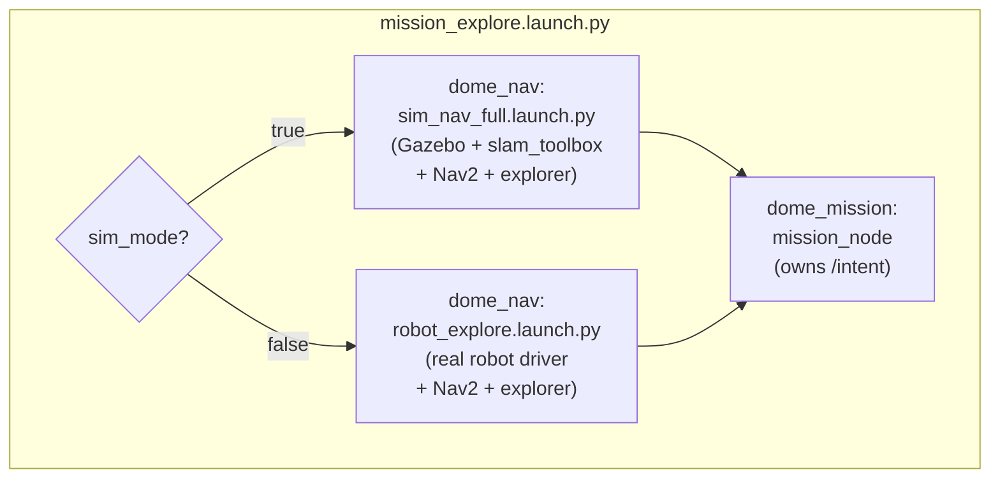
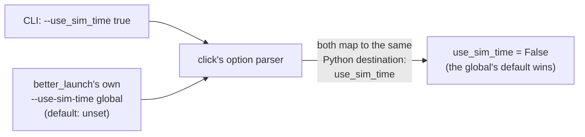

# The Top-Level Launch: composing two packages into one running system

## What "launch composition" means here

Every module documented so far lives inside a single Python process
(`mission_node`) and is unit-testable in isolation. None of them, alone,
produce a working robot — `mission_node` needs Nav2 running to drive
anywhere, and it needs `dome_nav`'s explorer running to explore anywhere.
`launch/mission_explore.launch.py` is the file that actually assembles a
runnable system: it starts `dome_nav`'s entire navigation/exploration
stack (Gazebo simulation *or* the real robot's drivers, SLAM, Nav2) and
then adds this package's `mission_node` on top as the single front door
(`/intent`) into the whole thing.

This file is written using `better_launch`, a wrapper around ROS2's
native launch system that favors plain Python functions and decorators
over the more verbose XML/Python launch-description idiom ROS2 ships
with by default. The whole file is one function.

## The shape of the composition

```python
@launch_this(ui=True)
def mission_explore_launch(
    sim_mode: str = "false",
    map_name: str = "",
    world_name: str = "",
    urdf_name: str = "minimal_sim.urdf",
):
    if not map_name:
        raise ValueError(
            "map_name is required: "
            "bl dome_mission mission_explore.launch.py --map_name <name>"
        )

    sim_mode = {
        "true": True,
        "t": True,
        "1": True,
        "yes": True,
        "false": False,
        "f": False,
        "0": False,
        "no": False,
    }[sim_mode.strip().lower()]

    bl = BetterLaunch()
    if sim_mode:
        bl.include(
            "dome_nav",
            "sim_nav_full.launch.py",
            map_name=map_name,
            world_name=world_name,
            urdf_name=urdf_name,
        )
    else:
        bl.include(
            "dome_nav",
            "robot_explore.launch.py",
            map_name=map_name,
            use_sim_time=str(sim_mode).lower(),
        )

    bl.node(
        "dome_mission",
        "mission_node",
        name="mission",
        ros_waittime=30.0,
    )
```

Four parameters, one required (`map_name`), a branch on `sim_mode`, one
`bl.include(...)` per branch, and one `bl.node(...)` at the end. That
final `bl.node(...)` call is the entire point of this package having its
own top-level launch file at all: everything above it is *reused*
composition of another package's stack; this one line is what actually
adds this package's own contribution.



Whichever branch runs, the result is the same shape: a fully-populated
Nav2 + explorer stack from `dome_nav`, with `mission_node` layered on top
as the only thing in the whole graph that subscribes `/intent`. That
single-subscriber invariant — no other node in the composed stack has its
own `/intent` handler — is a hard architectural requirement for this
package (see `mission_node.py`'s own docstring: *"owns `/intent`... the
sole `/intent` front-end"*), and this launch file is where that
invariant is actually assembled, not just asserted. It's worth noting
this is an *emergent* property of what each included launch file
happens to start, not something this file can verify for itself — it
depends on `dome_nav`'s explorer genuinely not subscribing `/intent`
anymore (a fact that has, in practice, needed live re-verification more
than once as `dome_nav` itself evolved).

## Why `sim_mode` exists as its own thing

The `sim_mode` parameter converts a string CLI flag into a `bool` used
purely to pick which of `dome_nav`'s two launch files to include. On the
surface this looks like it's answering the same question ROS2's own
`use_sim_time` convention answers — "are we in simulation?" — and an
earlier version of this file did in fact use that exact name. It was
renamed, and the reason is worth understanding in detail, because it's a
genuine footgun in the tooling this package is built on, not a stylistic
preference.

`better_launch` reserves `--use-sim-time` as a **framework-global**
option — it can change the default `use_sim_time` setting for an entire
launch tree, independent of any individual launch function's own
parameters. `click` (the CLI argument library `better_launch` is built
on) normalizes both the hyphenated global flag `--use-sim-time` *and* a
same-named function parameter written as `--use_sim_time` to the
identical Python destination variable, `use_sim_time`. When both exist,
the reserved global — which defaults to unset — silently wins over
whatever value the caller passed for the *launch function's own*
parameter of the same name. The practical result, confirmed live before
this file was renamed: passing `--use_sim_time true` on the command line
always arrived inside the launch function as `False`, with no error, no
warning — just silently wrong.



`sim_mode` sidesteps the entire collision by not sharing a name with
anything `better_launch` treats specially. It is a plain branching flag
for *this* launch file only — it never gets passed down as a ROS
parameter to any node. Each included launch file (`sim_nav_full.launch.py`,
`robot_explore.launch.py`) is separately responsible for setting the
*real* ROS-level `use_sim_time` for its own nodes internally, which is
exactly what the `else` branch's explicit `use_sim_time=str(sim_mode).lower()`
argument is doing — passing the resolved boolean through to
`robot_explore.launch.py` as an ordinary, non-colliding keyword argument,
not relying on any global.

This is a useful case study in a general lesson: when a tool reserves a
name for its own purposes, reusing that exact name for something
superficially similar but semantically distinct is a trap, even (maybe
especially) when the reuse seems like the "obviously correct" name to
pick. The fix isn't a workaround around the framework's behavior; it's
picking a name the framework has no opinion about.

## Parsing `sim_mode` without a library

```python
sim_mode = {
    "true": True,
    "t": True,
    "1": True,
    "yes": True,
    "false": False,
    "f": False,
    "0": False,
    "no": False,
}[sim_mode.strip().lower()]
```

Because `sim_mode` arrives as a raw CLI string (`click`/`better_launch`
don't coerce it to `bool` automatically once it's no longer using the
reserved-name mechanism), something has to turn `"true"`, `"1"`,
`"yes"`, etc. into an actual Python `bool`. This one-line dictionary
lookup is that parser: normalize case and surrounding whitespace, then
look up the canonical boolean. Because a Python `dict` literal used for
lookup either returns a value or raises `KeyError` — there is no silent
default — any string that isn't one of these eight recognized spellings
fails loudly rather than being quietly guessed at (e.g. treated as
falsy). That matches the project's broader "report, don't guess and fix"
philosophy for invalid input: a caller who typos `--sim_mode ture` gets
an immediate, if terse, crash rather than a launch that silently runs
the wrong stack.

## Observations

- **`sim_mode`'s `KeyError` on bad input carries no context.** Contrast
  this with `map_name`'s validation two lines above, which raises a
  `ValueError` with a helpful message showing the exact invocation to
  use. A bare `KeyError: 'ture'` from the dict lookup tells the caller
  *what* was wrong but not what the valid options are — a small,
  known inconsistency, kept as a one-line expression deliberately (at the
  cost of a friendlier error) rather than expanded into a multi-line
  `if`/`raise` to match `map_name`'s style.
- **The dome_semantic / OAK-D sub-stack isn't composed here yet.** Per the
  module docstring, this launch file only ever brings up navigation +
  exploration, never the semantic-perception pipeline that would populate
  `/semantic/targets`. That's consistent with the F33/TF33 blocker
  documented elsewhere (`02-doc/current.md`,
  `05-issues/open/I02-...md`) — go-to-label has no live data source in
  any launch this file currently offers, sim or real.
- **No validation that `world_name` is set when `sim_mode` is true.**
  `sim_nav_full.launch.py` is passed `world_name=world_name` even if it's
  the empty-string default; whatever validation exists for a missing
  world happens downstream, inside `dome_nav`'s own launch file, not
  here — this file only guards the one parameter (`map_name`) that
  applies to both branches equally.
