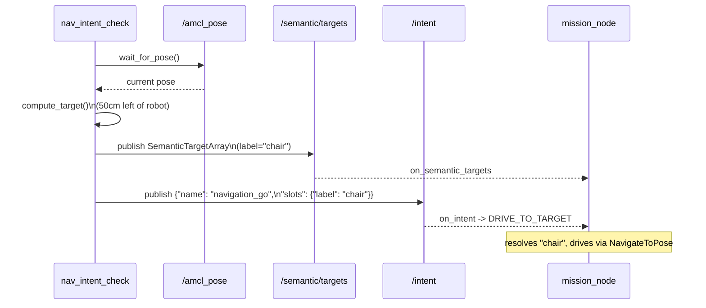

# Appendix: `nav_intent_check.py`, a manual go-to-target probe

## Why this exists outside the package proper

`nav_intent_check.py` lives in `tools/`, not in the `dome_mission` Python
package, and that placement is meaningful: it isn't part of the shipped
mission-sequencing system, and nothing in `mission_node.py` or the launch
file depends on it. It's a standalone diagnostic script — something a
developer runs by hand, once, against an already-live stack, to answer one
narrow question: *"if I hand `mission_node` a target and ask it to drive
there, does it actually work end to end?"*

That question matters because `mission_node`'s go-to-target path has three
separate collaborators that all have to line up correctly — `/amcl_pose`
publishing a real pose, `/semantic/targets` carrying a resolvable label,
and `/intent` accepting a `navigation_go` request — and, at the time this
tool was written, there was no automated way to produce all three in a
live ROS graph (no semantic-perception pipeline exists yet to publish real
targets; see the F33 blocker discussed in `04-mission_node.md`). This
script exists to manufacture the missing pieces itself, so a human can
verify the *consuming* side of that pipeline (this package) even before
the *producing* side (dome_semantic / dome_vision) exists.

## What it actually does, step by step

```python
def main():
    if not confirm_ready():
        print("Aborted.")
        sys.exit(0)

    rclpy.init()
    node = NavIntentChecker()

    print("\n[1/3] Waiting for AMCL pose...")
    if not node.wait_for_pose(timeout_sec=10.0):
        print("FAIL: /amcl_pose not received within 10s — stack up, AMCL converged?")
        node.destroy_node()
        rclpy.shutdown()
        sys.exit(1)
    ...
    target_x, target_y, target_yaw = node.compute_target()
    node.send_target(target_x, target_y, target_yaw)
    ...
    node.send_intent()
```

Three stages, numbered in the script's own `[1/3]`/`[2/3]`/`[3/3]` prints
so a human watching the terminal can follow along:

1. **Read the real robot pose** from `/amcl_pose` — this script needs an
   actual live pose to compute a sensible target relative to, so it
   reuses the exact same topic `mission_node.py` itself listens to.
   (Because of that, this tool inherits the same real-world limitation
   documented in `04-mission_node.md`: it only works when something is
   actually publishing AMCL localization — i.e. `dome_nav`'s
   *localization-mode* stack, not the explore/SLAM stack this package's
   own `mission_explore.launch.py` currently launches. The tool's own
   docstring says as much: *"Requires: the dome_mission + Nav2 stack
   running, AMCL converged."*)
2. **Manufacture a target 50cm to the robot's left** and publish it as a
   properly-typed `SemanticTargetArray` — standing in for the
   not-yet-built semantic perception pipeline.
3. **Publish a `navigation_go` intent** on `/intent`, the same message
   `mission_node.on_intent` would receive from any real caller.



By the time step 3's message reaches `mission_node`, the store already
has a matching, freshly-published "chair" target waiting for it (step 2
happens first, and `send_target` actively waits for a subscriber before
publishing — see below) — so the resolve in `drive_to_label` should
succeed deterministically, not depend on lucky timing.

## Computing a target relative to the robot

```python
def compute_target(self) -> tuple[float, float, float]:
    """Target 90 deg to the robot's left, GOAL_DIST_M away. Returns
    (x_m, y_m, yaw_rad) in the map frame; yaw faces along the offset."""
    pose = self.current_pose
    left_yaw = self.current_yaw() + math.pi / 2.0
    target_x = pose.position.x + GOAL_DIST_M * math.cos(left_yaw)
    target_y = pose.position.y + GOAL_DIST_M * math.sin(left_yaw)
    return (round(target_x, 3), round(target_y, 3), left_yaw)
```

A small, self-contained piece of 2D geometry: take the robot's current
heading, rotate it 90° counter-clockwise (`+ math.pi / 2.0`) to get "the
direction that is the robot's left," then walk `GOAL_DIST_M` (0.5 meters)
in that direction from the robot's current position using the standard
polar-to-cartesian offset (`cos`/`sin` of the angle, scaled by distance).
The returned `yaw` is the *same* angle used to compute the offset — the
target pose faces the same direction the offset was taken in, which is a
reasonable, arbitrary choice for a synthetic test target where the actual
final orientation doesn't matter, just that it's well-formed. The
`WARNING: Ensure at least 1m clear space in ALL directions` printed by
`confirm_ready()` exists precisely because this script is about to send a
real drive command close to the robot, on real (or simulated) hardware —
worth remembering this tool actually moves the robot, it doesn't just
inspect state.

## Two small but important robustness details

```python
def wait_for_subscriber(self, publisher, timeout_sec: float = 5.0):
    deadline = time.time() + timeout_sec
    while time.time() < deadline:
        if publisher.get_subscription_count() > 0:
            return
        rclpy.spin_once(self, timeout_sec=0.1)
```

Both `send_target` and `send_intent` call this before publishing. It's a
direct answer to a classic ROS gotcha: a freshly-created publisher can
have its very first message vanish into the void if it's sent before any
subscriber has finished discovering it — there's no guaranteed delivery
to a subscriber that connects a few milliseconds later. Rather than
publishing immediately and hoping, this helper actively polls
`get_subscription_count()` until at least one subscriber is attached (or
gives up after 5 seconds), so the script's own success or failure isn't
at the mercy of DDS discovery timing. `send_target` goes a step further
and publishes three times in a row after that (`for _ in range(3):
... publish(array) ... spin_for(0.1)`), a small extra margin of safety
for a QoS-mismatched or momentarily-slow subscriber, at negligible cost
since it's a one-shot manual diagnostic, not a hot path.

```python
def confirm_ready():
    ...
    return input("Proceed? [y/n]: ").strip().lower() == "y"
```

A manual `y`/`n` confirmation gate before anything happens at all — the
right call for a tool whose entire purpose is to move a real robot near
whatever's currently around it, run by a human sitting at a terminal, not
something meant to be scripted or CI-driven. This is precisely the kind
of "runtime-only, hardware, and physical-motion" tool the project's style
guide expects to be kept out of the automated test run and clearly marked
manual — which the module's own docstring achieves just by explaining, in
prose, exactly what will happen before it happens.

## Observations

- **No automated pass/fail signal.** The script's own docstring is candid
  about this: *"Terminal-status verification (done/failed) is not
  asserted here: dome_mission has no status topic yet (F08). Watch the
  robot / RViz, or the mission_node log, to confirm arrival."* This tool
  answers "did the message get sent" definitively (it checks subscriber
  counts) but can only answer "did the robot actually arrive" by asking a
  human to look. A future status topic on `mission_node` would let this
  script close that loop itself.
- **Hardcoded `LABEL = "chair"` and `GOAL_DIST_M = 0.50`** at module scope
  rather than CLI arguments — appropriate for a script this narrowly
  scoped (a smoke test, not a general-purpose tool), but worth knowing if
  a similar probe is ever needed at a different distance or label; today
  that means editing the source, not passing a flag.
- **Depends on the same `/amcl_pose` limitation documented for
  `mission_node.py`.** As things stand, this tool cannot be run at all
  against the explore/sim stack this package's own launch file starts
  (`--sim_mode true`), since nothing publishes `/amcl_pose` there — it
  needs `dome_nav`'s separate, currently-unwired localization-mode stack
  (see `05-issues/open/I02-...md`). Worth fixing (or at least documenting
  loudly at the top of the script) before the next person tries to run it
  against a fresh `mission_explore.launch.py --sim_mode true` and gets a
  confusing 10-second timeout instead of a robot arriving somewhere.
